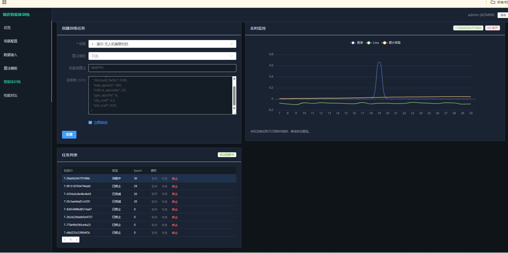

# 博弈智能体训练（课程设计）

多模块工程：**game-ai-frontend**（Vue）、**game-ai-backend**（Spring Boot + JWT + Redis）、**game-ai-engine**（FastAPI + PyTorch IPPO 多智能体网格环境）。

## 环境要求

- JDK 17、Maven 3.8+
- Node.js 18+（npm 或 pnpm）
- Python 3.9+
- MySQL 8.0、Redis 7+

## 快速启动

1. **MySQL**：创建库并执行 `game-ai-backend/src/main/resources/schema.sql`。若库已存在，执行 `schema_migration_20260321.sql` 增加 `checkpoint_path` 列。
2. **Redis**：默认 `localhost:6379`。
3. **算法引擎**（端口 8000）：

   ```bash
   cd game-ai-engine
   pip install -r requirements.txt
   python -m uvicorn app.main:app --host 0.0.0.0 --port 8000
   ```

4. **后端**（端口 8080）：编辑 `application.yml` 中数据源与 Redis，然后 `mvn spring-boot:run`。
5. **前端**（端口 5173）：`cd game-ai-frontend && npm install && npm run dev`

浏览器访问：<http://localhost:5173>  
默认账号：`admin` / `admin123`；指挥只读：`commander` / `commander123`。

## Docker 部署

在项目根目录执行 `docker compose up -d --build`，浏览器访问 **<http://localhost:3000>**（Nginx 反代 API/WebSocket）。  
端口说明、数据卷与故障排查见 [doc/DEPLOY.md](doc/DEPLOY.md)。

## 文档

- Docker 部署：[doc/DEPLOY.md](doc/DEPLOY.md)
- 演示脚本：[doc/DEMO_SCRIPT.md](doc/DEMO_SCRIPT.md)
- 性能自测：[doc/PERFORMANCE.md](doc/PERFORMANCE.md)
- 开发手册：[doc/开发手册.md](doc/开发手册.md)

## 能力摘要

- 训练：PyTorch **IPPO** 双策略；指标经 Redis → WebSocket；支持任务排队与 `checkpoint_path`。
- 推理：`POST /api/infer/predict`；离线评估：`POST /api/eval/rollout`。
- 数据：`POST /api/datasets/ingest`（需 ENGINEER/ADMIN）。

## 目录说明

| 目录 | 说明 |
|------|------|
| `game-ai-backend` | REST、WebSocket、Redis、调度 Python |
| `game-ai-engine` | 训练、推理、评估 API |
| `game-ai-frontend` | Vue3 + Vite + Element Plus |
| `doc` | 需求与演示文档 |

## 软件示例
